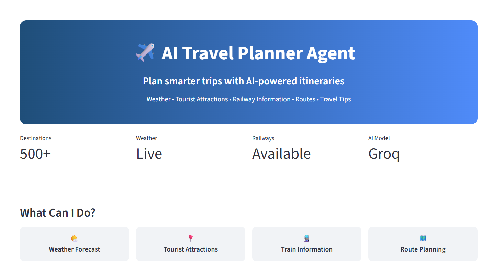
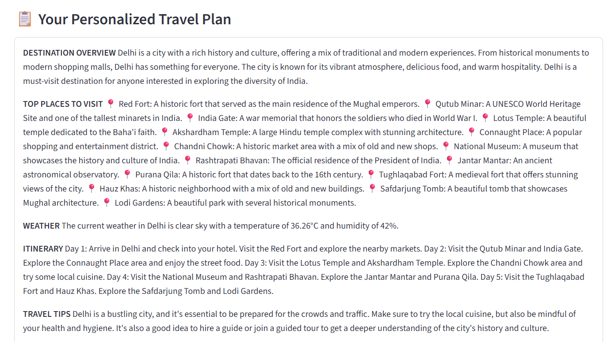
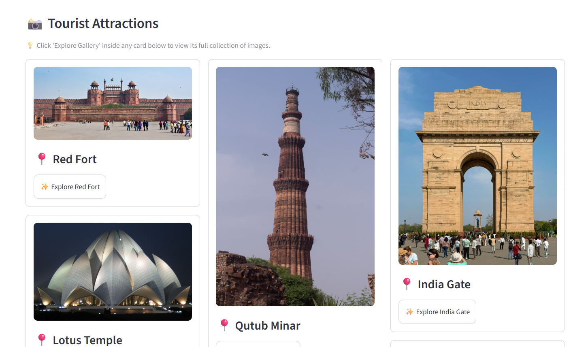
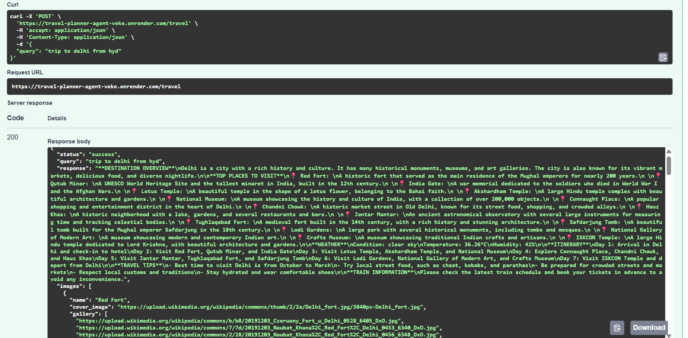

# 🌍 AI Travel Planner Agent

[]()
[]()
[]()
[]()
[]()

An AI-powered Travel Planner that generates personalized travel itineraries, recommends tourist attractions, and displays destination images using real-time data and Large Language Models (LLMs).

The application combines AI agents, FastAPI, Streamlit, and external APIs to deliver an intelligent and interactive travel-planning experience.

---

## 🚀 Live Demo

🔗 **Application(live on Streamlit):** https://travel-planner-agent-madhu.streamlit.app/
📖 **API Documentation(Backend on Render):** https://travel-planner-agent-veke.onrender.com


---

## 📸 Application Screenshots

### Home Page



### Travel Query Input


### Generated Travel Plan



### Tourist Destination Images



### API Documentation (Swagger UI)



---

## ✨ Features

* 🤖 AI-powered travel itinerary generation
* 🌍 Personalized trip recommendations
* 🗺️ Tourist attraction suggestions
* 📷 Destination cover and gallery images
* ⚡ FastAPI REST API backend
* 🎨 Streamlit interactive frontend
* 🔄 Modular AI Agent architecture
* 🔑 Secure environment variable configuration
* 📱 Responsive and user-friendly interface

---

## 🏗️ System Architecture

```text
User
  │
  ▼
Streamlit Frontend
  │
  ▼
FastAPI Backend
  │
  ▼
AI Travel Agent
  ├── Groq LLM
  ├── Travel Information APIs
  └── Image APIs
  │
  ▼
Personalized Travel Plan + Images
```

---

## 🛠️ Technology Stack

### Backend

* Python
* FastAPI
* Pydantic

### Frontend

* Streamlit

### AI & LLM

* Groq
* AI Agent Framework

### APIs

* Travel Information APIs
* Image Search APIs

### Development Tools

* Git
* GitHub
* Virtual Environment (venv)

---

## 📂 Project Structure

```text
Travel-Planner-Agent/
│
├── tools/
│   ├── image_tool.py
│   └── ...
│
├── agent.py
├── api.py
├── app.py
├── requirements.txt
├── .env
├── images/
│   ├── home_page.png
│   ├── query_input.png
│   ├── travel_plan.png
│   ├── gallery.png
│   └── swagger_ui.png
│
├── README.md
└── .gitignore
```

---

## ⚙️ Installation

### 1. Clone the Repository

```bash
git clone https://github.com/MadhukarJeedi/Travel-Planner-Agent.git
cd Travel-Planner-Agent
```

### 2. Create a Virtual Environment

#### Windows

```bash
python -m venv venv
venv\Scripts\activate
```

#### Linux / macOS

```bash
python3 -m venv venv
source venv/bin/activate
```

### 3. Install Dependencies

```bash
pip install -r requirements.txt
```

---

## 🔑 Environment Variables

Create a `.env` file in the root directory.

```env
OPENWEATHER_API_KEY = Paste your OPENWEATHER API KEY for getting live weather info
GROQ_API_KEY = Paste your GROQ API KEY 
RAPIDAPI_KEY = paste your RAPID API KEY for getting live trains info
ORS_API_KEY = Paste your OpenRouteService API KEY for Route Planning
GEOAPIFY_API_KEY = Paste your Geoapify API KEY for Tourist Places
UNSPLASH_API_KEY=Paste your PEXELS API KEY for Tourist Places images
```

---

## ▶️ Run the FastAPI Backend

```bash
uvicorn api:app --reload
```

Open:

```text
http://127.0.0.1:8000
```

Swagger Documentation:

```text
http://127.0.0.1:8000/docs
```

---

## ▶️ Run the Streamlit Frontend

```bash
streamlit run app.py
```

---

## 📡 API Endpoint

### Generate Travel Plan

**POST** `/travel`

#### Request

```json
{
  "query": "Plan a 5-day trip to Goa"
}
```

#### Response

```json
{
  "travel_plan": "Generated itinerary...",
  "cover_image": "image_url",
  "gallery_images": [
    "image1_url",
    "image2_url",
    "image3_url"
  ]
}
```

---

## 💡 Sample Queries

* Plan a 3-day trip to Kerala
* Family vacation in Manali
* Budget trip to Goa
* Honeymoon trip to Bali
* Best places to visit in Hyderabad
* Weekend getaway near Bangalore

---

## 🎯 Key Highlights

* AI-generated travel itineraries
* Real-time destination images
* FastAPI REST services
* Streamlit interactive UI
* Modular and scalable architecture
* Easy integration with external APIs
* Recruiter-friendly project structure

---

## 🔮 Future Enhancements

* 🏨 Hotel recommendations
* ✈️ Flight search integration
* 🌤️ Weather forecasting
* 📍 Google Maps integration
* 💰 Budget estimation
* 📄 PDF itinerary generation
* 🎙️ Voice-enabled travel assistant
* 🌐 Multi-language support

---

## 🤝 Contributing

Contributions are welcome.

1. Fork the repository
2. Create a feature branch
3. Commit your changes
4. Push to your branch
5. Open a Pull Request

---

## 👨‍💻 Author

**Madhukar Jeedi**

GitHub: https://github.com/MadhukarJeedi

LinkedIn: https://www.linkedin.com/in/madhukarjeedi/
---

## ⭐ Support

If you found this project useful, please consider giving it a ⭐ on GitHub.

Your support helps improve the project and encourages future development.
