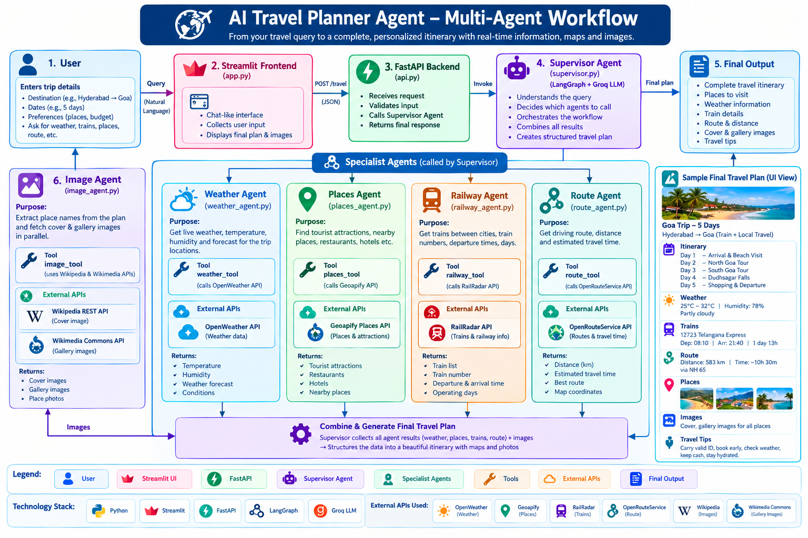

# 🌍 AI Travel Planner Agent

[](https://www.python.org/)
[](https://fastapi.tiangolo.com/)
[](https://streamlit.io/)
[](https://langchain-ai.github.io/langgraph/)
[](https://groq.com/)
[](LICENSE)
[]()

> An intelligent, multi-agent AI travel planner that generates fully personalized travel itineraries using real-time data — covering weather, tourist attractions, train schedules, driving routes, and destination images — all orchestrated by a LangGraph Supervisor Agent.

---

## 🚀 Live Demo

| Service | URL |
|---------|-----|
| 🌐 Streamlit App | https://travel-planner-agent-madhu.streamlit.app/ |
| 📖 FastAPI Docs (Swagger) | https://travel-planner-agent-veke.onrender.com/docs |

---

## 📸 Screenshots

### Application Workflow


### Home Page


### Travel Query Input


### Generated Travel Plan


### Tourist Destination Gallery


### API Documentation (Swagger UI)


---

## ✨ Features

| Feature | Description |
|---------|-------------|
| 🤖 **Multi-Agent Orchestration** | LangGraph Supervisor coordinates all specialist sub-agents |
| 🌤️ **Live Weather** | Real-time weather via OpenWeather API |
| 📍 **Tourist Attractions** | Top places powered by Geoapify API |
| 🚆 **Train Schedules** | Indian railway info via RailRadar API |
| 🗺️ **Route Planning** | Driving distance & time via OpenRouteService API |
| 📷 **Destination Images** | Cover + gallery images via Wikipedia/Wikimedia Commons (no API key needed) |
| ⚡ **FastAPI Backend** | High-performance REST API with Swagger documentation |
| 🎨 **Streamlit Frontend** | Interactive, chat-history-aware UI |
| 🔄 **Parallel Image Fetching** | ThreadPoolExecutor fetches all place images concurrently |
| 🔑 **Secure Config** | All API keys managed via `.env` |

---

## 🏗️ System Architecture

The project follows a **Supervisor → Specialist Agents** multi-agent pattern using **LangGraph StateGraph**.

```text
User Query
    |
    v
Streamlit Frontend  (app.py)
    |  HTTP POST /travel
    v
FastAPI Backend  (api.py)
    |
    v
agent.py  --re-exports-->  SupervisorAgent  (supervisor.py)
                                   |
                         LangGraph StateGraph
                                   |
                     +-------------+-------------+
                     v                           v
              supervisor_node             image_node
              (ReAct Agent)         (Image Agent - parallel)
                     |
        +------------+------------+-----------+
        v            v            v           v
   get_weather   get_places   get_trains  get_route
        |            |            |           |
   weather_tool  places_tool  railway_tool  route_tool
        |            |            |           |
   OpenWeather    Geoapify    RailRadar   OpenRoute
      API           API          API      Service API
```

### Data Flow

1. **User** submits a natural language travel query in the Streamlit UI
2. **Streamlit** POSTs the query to the FastAPI `/travel` endpoint
3. **FastAPI** calls `SupervisorAgent.invoke()`
4. The **Supervisor Node** runs a ReAct (Reason + Act) loop — calling whichever specialist tools are needed
5. The **Image Node** fetches Wikipedia images for all extracted place names (in parallel)
6. The final **travel plan + images** are returned to Streamlit and rendered

---

## 🧠 Agent Architecture — Deep Dive

### 1. 🧭 Supervisor Agent (`supervisor.py`)

The brain and orchestrator of the entire system. Built as a **LangGraph `create_react_agent`** that:

- Receives the user's natural language travel query
- Decides **which tools to call and in what order** using the ReAct reasoning loop
- Calls `get_weather`, `get_places`, `get_trains`, `get_route` as needed
- Synthesizes all tool outputs into a structured travel plan:

```
DESTINATION OVERVIEW
TOP PLACES TO VISIT  (📍 Place: description for each)
WEATHER              (Condition, Temperature, Humidity)
ITINERARY            (Day-by-day plan)
TRAVEL TIPS          (5-8 practical tips)
TRAIN INFORMATION    (🚆 Train Name | Train No | Departure)
```

**LLM:** Groq `qwen/qwen3.8-27b` · Temperature `0.2` · Max Tokens `900`

---

### 2. 🖼️ Image Agent (`agents/image_agent.py`)

Post-processing specialist that runs **after** the supervisor:

- Extracts all `📍 Place Name` entries from the travel plan using regex
- Fetches a **cover image** and up to 5 **gallery images** per place via Wikipedia/Wikimedia Commons
- Uses `ThreadPoolExecutor` (6 workers) to fetch all images **in parallel** — no sequential bottleneck
- Returns an ordered list of `{ name, cover_image, gallery }` dicts
- Falls back gracefully: if no Wikipedia image exists, `cover_image` is `None` and `gallery` is `[]`

---

### 3. 🌤️ Weather Agent (`agents/weather_agent.py`)

- Wraps `weather_tool` as a LangGraph ReAct agent
- Given a city name → fetches live: **condition**, **temperature (°C)**, **humidity (%)**
- Zero hallucination policy: strictly reports only what the OpenWeather API returns
- **LLM:** Groq `qwen/qwen3.8-27b` · Temperature `0.1`

---

### 4. 📍 Places Agent (`agents/places_agent.py`)

- Wraps `places_tool` as a LangGraph ReAct agent
- Returns **top 10–15 tourist attractions** for a destination using the Geoapify Places API
- Formats each result as: `📍 Place Name:` + one-line description
- Does not invent places not returned by the API

---

### 5. 🚆 Railway Agent (`agents/railway_agent.py`)

- Wraps `railway_tool` as a LangGraph ReAct agent
- Finds direct trains between two Indian cities using the **RailRadar API**
- Includes: **train name**, **train number**, **departure time**, **operating days**
- Covers 30+ major Indian cities via a built-in city → station code lookup table

---

### 6. 🗺️ Route Agent (`agents/route_agent.py`)

- Wraps `route_tool` as a LangGraph ReAct agent
- Calculates **driving distance (km)** and **estimated travel time** between two cities
- Uses the **OpenRouteService API** — real road network data, not straight-line distance

---

## 🛠️ Tools (`tools/`)

| Tool | File | API | Purpose |
|------|------|-----|---------|
| `weather_tool` | `tools/weather.py` | OpenWeather API | Live weather for a city |
| `places_tool` | `tools/places.py` | Geoapify Places API | Top tourist attractions |
| `railway_tool` | `tools/railway.py` | RailRadar API | Trains between two stations |
| `route_tool` | `tools/route.py` | OpenRouteService | Driving route & distance |
| `get_cover_image` | `tools/image_tool.py` | Wikipedia REST API | Cover image for a place |
| `get_gallery_images` | `tools/image_tool.py` | Wikimedia Commons API | Gallery images for a place |

### Railway Tool — Station Code Mapping (Built-in)

```python
"hyderabad" -> "SC"     "delhi"     -> "NDLS"   "mumbai"    -> "CSTM"
"goa"       -> "MAO"    "bangalore" -> "SBC"    "chennai"   -> "MAS"
"kolkata"   -> "HWH"    "pune"      -> "PUNE"   "jaipur"    -> "JP"
# ... 30+ cities supported
```

---

## 📂 Project Structure

```text
Travel-Planner-Agent/
|
+-- agents/                       # Specialist LangGraph ReAct sub-agents
|   +-- __init__.py
|   +-- image_agent.py            # Parallel image fetcher (Wikipedia/Wikimedia)
|   +-- weather_agent.py          # Weather specialist (OpenWeather)
|   +-- places_agent.py           # Tourist attractions specialist (Geoapify)
|   +-- railway_agent.py          # Indian railways specialist (RailRadar)
|   +-- route_agent.py            # Driving route specialist (OpenRouteService)
|
+-- tools/                        # Raw API tool functions (@tool decorated)
|   +-- weather.py                # OpenWeather API integration
|   +-- places.py                 # Geoapify Places API integration
|   +-- railway.py                # RailRadar API + city->station code mapping
|   +-- route.py                  # OpenRouteService API integration
|   +-- image_tool.py             # Wikipedia + Wikimedia Commons image fetcher
|
+-- images/                       # Screenshots used in this README
|   +-- work_flow.png
|   +-- home_page.png
|   +-- query_input.png
|   +-- travel_plan.png
|   +-- gallery.png
|   +-- swagger_ui.png
|
+-- supervisor.py                 # Main supervisor agent + LangGraph StateGraph
+-- agent.py                      # Thin shim -- re-exports SupervisorAgent as agent
+-- api.py                        # FastAPI REST API  (POST /travel)
+-- app.py                        # Streamlit frontend UI
+-- requirements.txt              # Python dependencies
+-- .env                          # Your secret API keys (not committed to Git)
+-- .env.example                  # Template for API keys
+-- .gitignore
+-- README.md
```

---

## ⚙️ Installation & Setup

### Prerequisites

- Python **3.10** or higher
- `pip` package manager
- API keys for the external services (all have free tiers)

---

### Step 1 — Clone the Repository

```bash
git clone https://github.com/MadhukarJeedi/Travel-Planner-Agent.git
cd Travel-Planner-Agent
```

### Step 2 — Create a Virtual Environment

**Windows:**
```bash
python -m venv venv
venv\Scripts\activate
```

**Linux / macOS:**
```bash
python3 -m venv venv
source venv/bin/activate
```

### Step 3 — Install Dependencies

```bash
pip install -r requirements.txt
```

### Step 4 — Configure Environment Variables

```bash
cp .env.example .env
# Then open .env and fill in your API keys
```

---

## 🔑 Environment Variables

```env
# LLM Provider (required)
GROQ_API_KEY=your_groq_api_key_here

# Weather (required)
OPENWEATHER_API_KEY=your_openweather_api_key_here

# Tourist Attractions (required)
GEOAPIFY_API_KEY=your_geoapify_api_key_here

# Indian Railways (required for train info)
RAILRADAR_API_KEY=your_railradar_api_key_here

# Driving Routes (required for route info)
ORS_API_KEY=your_openrouteservice_api_key_here
```

### Where to Get API Keys

| Variable | Service | Free Tier | Sign Up |
|----------|---------|-----------|---------|
| `GROQ_API_KEY` | Groq Cloud (LLM) | ✅ Yes | https://console.groq.com |
| `OPENWEATHER_API_KEY` | OpenWeatherMap | ✅ Yes | https://openweathermap.org/api |
| `GEOAPIFY_API_KEY` | Geoapify Places | ✅ Yes (3000 req/day) | https://www.geoapify.com |
| `RAILRADAR_API_KEY` | RailRadar API | ✅ Yes | https://railradar.in |
| `ORS_API_KEY` | OpenRouteService | ✅ Yes | https://openrouteservice.org |

> **📝 Note:** Images use **Wikipedia / Wikimedia Commons** — completely free, no API key required.

---

## ▶️ Running the Application

You need **two terminals** running simultaneously.

### Terminal 1 — Start the FastAPI Backend

```bash
uvicorn api:app --host 0.0.0.0 --port 8000 --reload
```

| URL | Purpose |
|-----|---------|
| `http://localhost:8000` | API root |
| `http://localhost:8000/docs` | Swagger UI (interactive API docs) |
| `http://localhost:8000/redoc` | ReDoc documentation |

### Terminal 2 — Start the Streamlit Frontend

```bash
streamlit run app.py
```

Open **`http://localhost:8501`** in your browser.

---


---

## 🐳 Docker Deployment

You can run the entire application using Docker — no local Python install or dependency setup required.

### Prerequisites

- [Docker Desktop](https://www.docker.com/products/docker-desktop/) installed and running
- A `.env` file in the project root with all your API keys

### Project Docker Files

| File | Purpose |
|------|---------|
| `Dockerfile` | Multi-stage build — `builder` installs deps, `runtime` is the slim production image |
| `docker-compose.yml` | Orchestrates the `api` (FastAPI) and `app` (Streamlit) containers |
| `.dockerignore` | Excludes `venv/`, `__pycache__/`, `.env`, `.git/` from the build context |

### Architecture Inside Docker

```
Docker Network
    ├── travel_planner_api   (FastAPI)   → port 8000
    │        ↑
    │   API_URL=http://api:8000/travel
    │        ↓
    └── travel_planner_app   (Streamlit) → port 8501
```

Streamlit talks to FastAPI using Docker's internal DNS (`http://api:8000/travel`), so no manual IP configuration is needed.

### Build and Run

**Start both services (build + run):**

```bash
docker-compose up --build
```

**Run in detached / background mode:**

```bash
docker-compose up --build -d
```

**Stop all containers:**

```bash
docker-compose down
```

**View live logs:**

```bash
docker-compose logs -f
```

**View logs for a specific service:**

```bash
docker-compose logs -f api
docker-compose logs -f app
```

### Access the App

| Service | URL |
|---------|-----|
| 🎨 Streamlit UI | http://localhost:8501 |
| ⚡ FastAPI Root | http://localhost:8000 |
| 📖 Swagger Docs | http://localhost:8000/docs |

### Dockerfile Overview

The `Dockerfile` uses a **multi-stage build** to keep the final image lean:

```dockerfile
# Stage 1: Builder — installs all Python dependencies
FROM python:3.10-slim AS builder
RUN pip install --no-cache-dir --prefix=/install -r requirements.txt

# Stage 2: Runtime — copies only installed packages + source code
FROM python:3.10-slim AS runtime
COPY --from=builder /install /usr/local
COPY . .
# Runs as non-root user for security
USER appuser
CMD ["uvicorn", "api:app", "--host", "0.0.0.0", "--port", "8000"]
```

### Health Check

The `api` service has a built-in Docker health check. The `app` (Streamlit) container will only start **after** the FastAPI backend passes its health check — ensuring no connection errors on startup.

> **📝 Note:** Make sure your `.env` file exists with all required API keys before running `docker-compose up`.

## 📡 API Reference

### `POST /travel`

Generates a complete AI-powered travel plan.

**Request:**

```http
POST http://localhost:8000/travel
Content-Type: application/json

{
  "query": "Plan a 3-day trip to Goa from Hyderabad"
}
```

**Success Response `200 OK`:**

```json
{
  "status": "success",
  "query": "Plan a 3-day trip to Goa from Hyderabad",
  "response": "**DESTINATION OVERVIEW**\nGoa is India's smallest state...",
  "images": [
    {
      "name": "Calangute Beach",
      "cover_image": "https://upload.wikimedia.org/wikipedia/commons/...",
      "gallery": [
        "https://upload.wikimedia.org/wikipedia/commons/..."
      ]
    }
  ]
}
```

**Error Response:**

```json
{
  "status": "error",
  "message": "Query cannot be empty."
}
```

---

## 🧩 LangGraph State & Graph Definition

### State

```python
class TravelState(TypedDict):
    query: str           # Original user travel question
    travel_plan: str     # Synthesized plan text (filled by supervisor_node)
    images: list[dict]   # [{name, cover_image, gallery}] (filled by image_node)
    places: list[str]    # Extracted place names used for image fetching
```

### Graph Edges

```
START --> supervisor_node --> image_fetcher --> END
```

---

## 💬 Sample Queries

```
Plan a 3-day trip to Goa from Hyderabad
Best tourist places in Jaipur
Weekend trip to Mysore from Bangalore
5-day Rajasthan tour starting from Delhi
Family vacation in Manali
Honeymoon destination in Kerala
Budget trip to Pondicherry from Chennai
Weather and travel tips for Shimla in December
```

---

## 🎯 Key Highlights

- ✅ Real multi-agent system — not a single monolithic LLM call
- ✅ LangGraph StateGraph with clean node separation
- ✅ Parallel image fetching with ThreadPoolExecutor
- ✅ Zero hallucination for factual data (trains, weather, routes)
- ✅ Graceful error handling at every API layer
- ✅ FastAPI + Streamlit clean separation of concerns
- ✅ Session history — revisit any past travel query from the sidebar

---

## 🔮 Future Enhancements

- [ ] 🏨 Hotel recommendations (Booking.com / MakeMyTrip API)
- [ ] ✈️ Flight search integration (Amadeus / Skyscanner API)
- [ ] 💰 Automated budget estimation per trip
- [ ] 📄 PDF itinerary download/export
- [ ] 🗺️ Interactive Google Maps embed with route overlay
- [ ] 🎙️ Voice query support (speech-to-text)
- [ ] 🌐 Multi-language travel plan output
- [ ] 💬 Multi-turn chat conversation mode
- [ ] 📱 Mobile-first responsive UI redesign

---

## 🐛 Troubleshooting

| Issue | Likely Cause | Fix |
|-------|-------------|-----|
| `GROQ_API_KEY is not set` | Missing `.env` file | Create `.env` with all required keys |
| Cannot reach the travel planner API | FastAPI not running | Run `uvicorn api:app --reload` first |
| Request timed out | LLM slow to respond | Increase `REQUEST_TIMEOUT` in `app.py` (default: 90s) |
| No train results returned | City not in station map | Use station code directly (e.g., `SC` for Hyderabad) |
| No images showing | Wikipedia page name mismatch | Expected for lesser-known places; others still work |
| ImportError for `create_agent` | Wrong import path | Use `create_react_agent` from `langgraph.prebuilt` |

---

## 📦 Dependencies

```text
langchain
langchain-community
langchain-core
langchain-groq
langgraph
fastapi
uvicorn
streamlit
pydantic
requests
python-dotenv
```

Install all with:
```bash
pip install -r requirements.txt
```

---

## 🤝 Contributing

Contributions are welcome!

1. **Fork** the repository
2. Create a feature branch: `git checkout -b feature/my-feature`
3. Commit your changes: `git commit -m 'Add my feature'`
4. Push to the branch: `git push origin feature/my-feature`
5. Open a **Pull Request**

---

## 📄 License

This project is licensed under the **MIT License** — free to use, modify, and distribute.

---

## 👨‍💻 Author

**Madhukar Jeedi**

[](https://github.com/MadhukarJeedi)
[](https://www.linkedin.com/in/madhukarjeedi/)

---

## ⭐ Support

If you found this project useful, please consider giving it a ⭐ on GitHub!

Your support helps improve the project and encourages future development. 🙏
